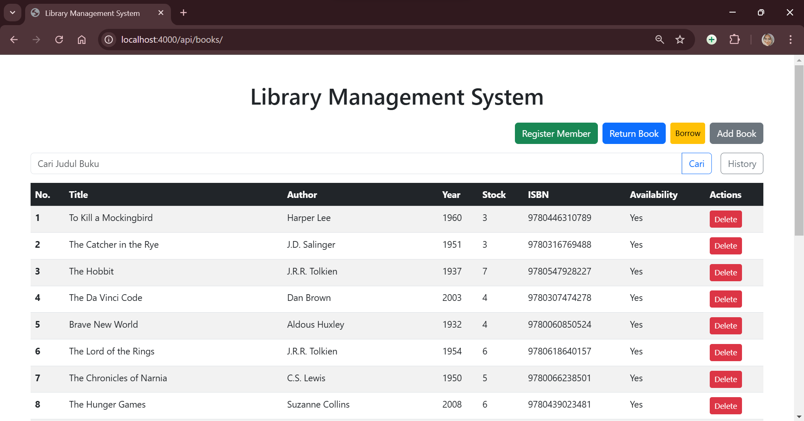
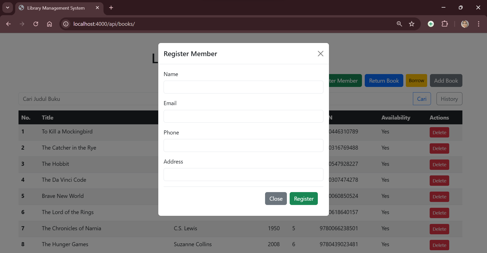
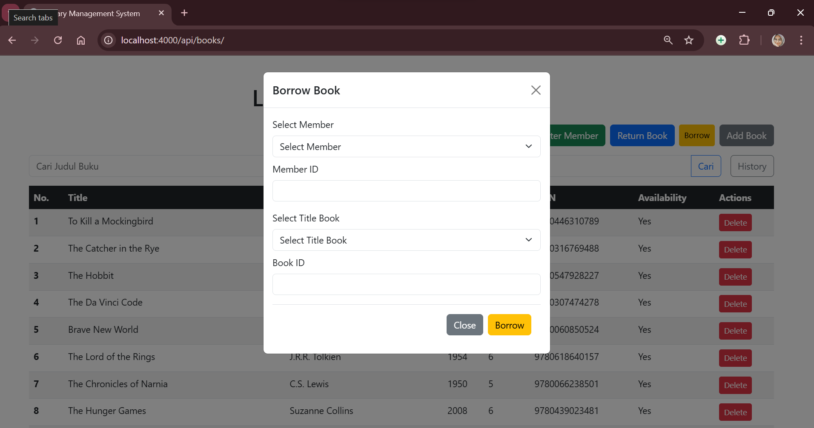
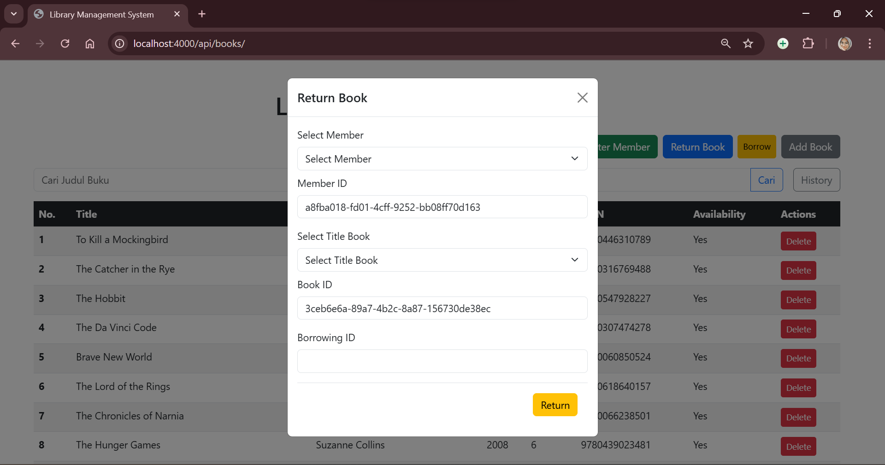
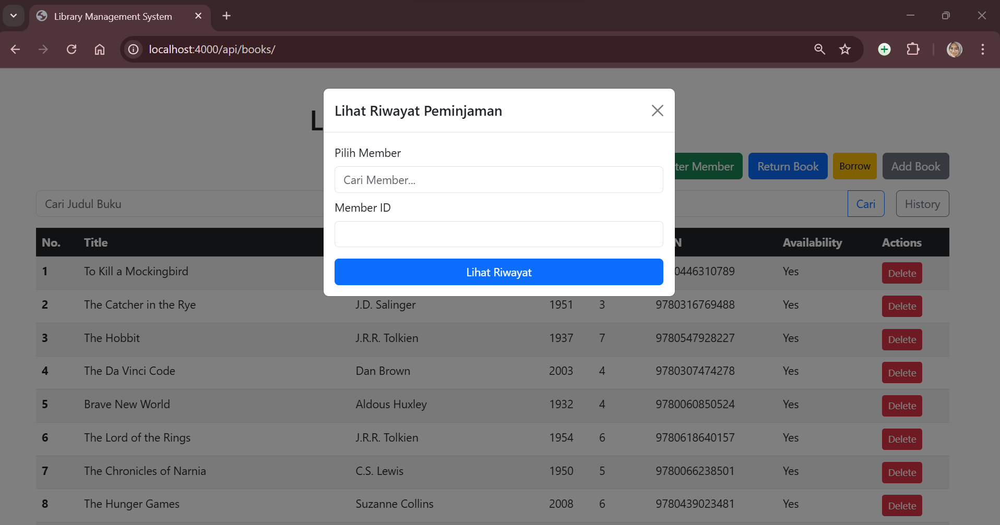
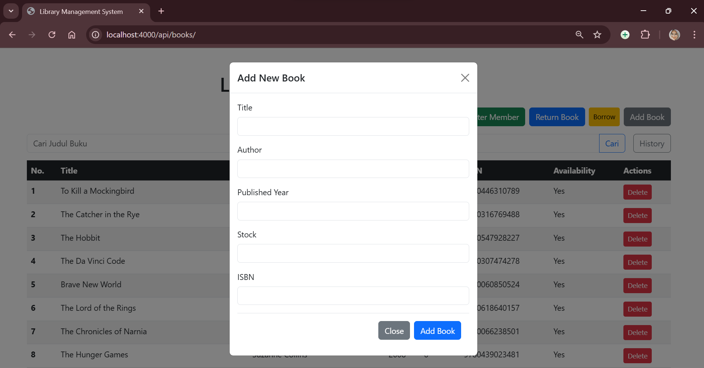

# Library Management System

## 📚 Deskripsi
Ini adalah aplikasi RESTful API untuk sistem manajemen perpustakaan menggunakan Express.js. 

Proyek ini menggunakan PostgreSQL sebagai database dan mengikuti struktur direktori yang ditentukan sebagai tugas teknikal.

## 📂 Struktur Proyek
/library-management-system

│

├── /config

│   └── database.js

│

├── /controllers

│   ├── bookController.js

│   ├── memberController.js

│   └── borrowingController.js

│

├── /models

│   ├── book.js

│   ├── member.js

│   └── borrowing.js

│

├── /services

│   ├── bookService.js

│   ├── memberService.js

│   └── borrowingService.js

│

├── /routes

│   ├── bookRoutes.js

│   ├── memberRoutes.js

│   └── borrowingRoutes.js

│

├── /views

│   └── index.ejs

│

└── app.js

## 🚀 Project Setup
  
**1. Installation Steps**

 ```
git clone https://github.com/suciwuland/Library-Management.git
cd Library-Management
npm install
```

**2. Configure Database**

```
psql -U postgres
CREATE DATABASE library_management;
\c library_management;

psql -U postgres -d library_management -f Library-Management/schema.sql
```

**3. Update konfigurasi di ```src/config/database.js```**

```{ user: 'postgres',
 host: 'localhost',
 database: 'library_management',
 password: '<your_password>',
 port: 5432
 }
```

## 📜 Cara Menjalankan Aplikasi

```
npm start
```

the server will run on ```http://localhost:4000```

## 📌 Fitur

- Kelola data buku: Tambah, hapus, dan lihat buku di perpustakaan.
- Kelola data anggota: Tambah anggota
- Kelola transaksi peminjaman dan pengembalian: Proses peminjaman dan pengembalian buku dengan status otomatis.

## 📷 Interface Project








## ⚙️ Dokumentasi API

**1. GET  /api/books/allbook?page=1&limit=2**

Response:
```
{
  "data": [
    {
      "id": "4cca4872-b6b0-4731-8e14-7ba73aadbdb7",
      "title": "1984",
      "author": "George Orwell",
      "published_year": 1949,
      "stock": 3,
      "isbn": "9780451524935",
      "available": true
    },
    {
      "id": "d1dbed67-5241-4bea-8859-bcd969f36379",
      "title": "Brave New World",
      "author": "Aldous Huxley",
      "published_year": 1932,
      "stock": 4,
      "isbn": "9780060850524",
      "available": true
    }
  ],
  "pagination": {
    "total": 22,
    "page": 1,
    "limit": 2,
    "totalPages": 11
  }
}
```

**2.  POST /api/members**

Request:
```
{
    name: "suciwulan",
    email: "suciwd3@gmail.com",
    phone: "089507495248",
    address: "lhokseumawe"
}
```

Response:
```
{
    "id": "3c4e66a7-5aac-45d8-9f49-21e617a5d5d6",
    "name": "suciwulan",
    "email": "suciwd3@gmail.com",
    "phone": "089507495248",
    "address": "lhokseumawe",
    "created_at": "2024-12-14T09:47:45.154Z",
    "updated_at": "2024-12-14T09:47:45.154Z"
}
```
 **3. POST /api/borrowings**

Request:
```
{
    bookId: 'ab55f00a-7bab-49f5-be8b-10e4a4de6050',
    memberId: '3c4e66a7-5aac-45d8-9f49-21e617a5d5d6'
}
```

Response:
```
{
    "id": "f263effb-7317-4eb5-915e-8f53e1f17043",
    "book_id": "ab55f00a-7bab-49f5-be8b-10e4a4de6050",
    "member_id": "3c4e66a7-5aac-45d8-9f49-21e617a5d5d6",
    "borrow_date": "2024-12-14",
    "status": "BORROWED",
    "created_at": "2024-12-14T09:49:09.690Z",
    "updated_at": "2024-12-14T09:49:09.690Z",
    "return_date": null
}
```
**4. PUT  /api/borrowings/:id/return**

Response:
```
{
    "message": "Book returned successfully",
    "borrowing": {
        "id": "f263effb-7317-4eb5-915e-8f53e1f17043",
        "book_id": "ab55f00a-7bab-49f5-be8b-10e4a4de6050",
        "member_id": "3c4e66a7-5aac-45d8-9f49-21e617a5d5d6",
        "borrow_date": "2024-12-14",
        "return_date": "2024-12-14T16:56:16.672Z",
        "status": "RETURNED",
        "created_at": "2024-12-14T09:49:09.690Z",
        "updated_at": "2024-12-14T09:49:09.690Z"
    }
}
```
**5. GET  /api/members/:id/borrowings?status=RETURNED&page=1&limit=2**

Response:
```
[
  {
    "id": "1db7deb9-df99-4a1b-8270-a85f9a71a47e",
    "book_id": "262701f6-2425-42fe-8915-dc70143d576d",
    "member_id": "0713f40c-8776-4516-9ec1-9f5649c93839",
    "borrow_date": "2024-12-13",
    "return_date": "2024-12-13",
    "status": "RETURNED",
    "created_at": "2024-12-13T11:46:24.704Z",
    "updated_at": "2024-12-13T11:46:24.704Z",
    "Book": {
      "id": "262701f6-2425-42fe-8915-dc70143d576d",
      "title": "One Hundred Years of Solitude",
      "author": "Gabriel García Márquez",
      "published_year": 1967,
      "isbn": "9780060883287"
    },
    "Member": {
      "id": "0713f40c-8776-4516-9ec1-9f5649c93839",
      "name": "Suci"
    }
  },
  {
    "id": "5011b916-355a-4f46-bb4a-f6fed631f259",
    "book_id": "d70d3eed-e3a2-4868-8117-d801b784333d",
    "member_id": "0713f40c-8776-4516-9ec1-9f5649c93839",
    "borrow_date": "2024-12-13",
    "return_date": "2024-12-13",
    "status": "RETURNED",
    "created_at": "2024-12-13T08:45:21.545Z",
    "updated_at": "2024-12-13T08:45:21.545Z",
    "Book": {
      "id": "d70d3eed-e3a2-4868-8117-d801b784333d",
      "title": "The Great Gatsby",
      "author": "F. Scott Fitzgerald",
      "published_year": 1925,
      "isbn": "9780743273565"
    },
    "Member": {
      "id": "0713f40c-8776-4516-9ec1-9f5649c93839",
      "name": "Suci"
    }
  }
]
```

**6. POST  /api/books/addbooks**

Request:
```
{
   title: "Laskar Pelangi",
   author: "Andrea Hirata",
   published_year: 2005,
   stock: 6,
   isbn: "9789792720160"
}
```
Response:
```
{
    "id": "e269915f-7e6f-4b70-a872-b410aaf9c686",
    "title": "Laskar Pelangi",
    "author": "Andrea Hirata",
    "published_year": 2005,
    "stock": 6,
    "isbn": "9789792720160",
    "created_at": "2024-12-14T10:06:43.936Z",
    "updated_at": "2024-12-14T10:06:43.936Z"
}
```
**7. DELETE  /api/books/delete/:id**
```
{
  "message": "Book deleted successfully!"
}
```
## ✨ Penutup
Terima kasih telah meluangkan waktu untuk meninjau proyek ini.

Saya berharap implementasi ini dapat menunjukkan pemahaman saya dalam membangun RESTful API serta mengelola kode dengan struktur yang baik. 


